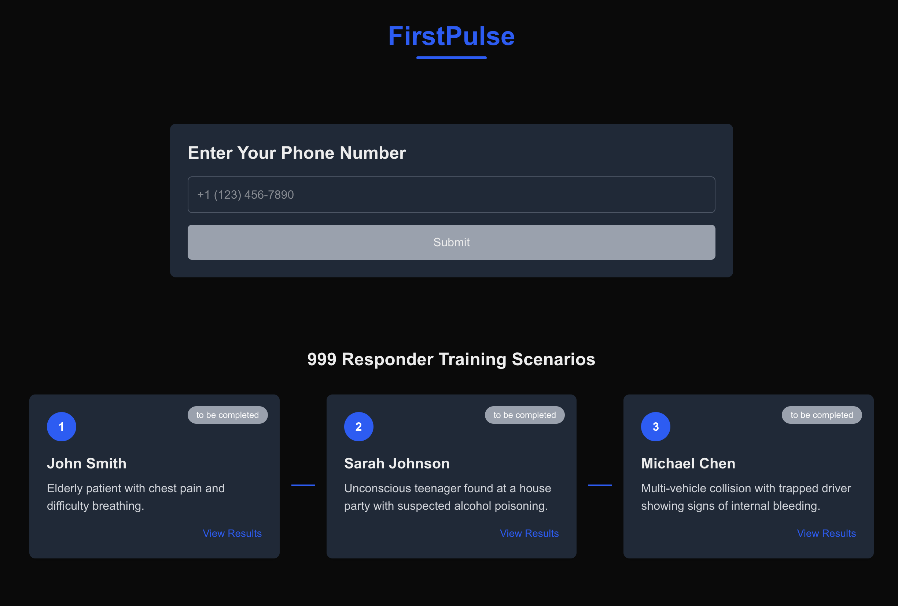

# FirstPulse - Emergency Response Training Platform



## Overview

FirstPulse is an innovative training platform for emergency responders, simulating critical 999/911 calls to develop and assess response skills. The system creates realistic emergency scenarios with AI-powered callers, enabling responders to practice handling high-pressure situations without real-world consequences.

## Features

- **Realistic Emergency Scenarios**: Three distinct emergency simulations with unique challenges:

  - **John Smith**: Elderly patient with chest pain and difficulty breathing
  - **Sarah Johnson**: Unconscious teenager with suspected alcohol poisoning
  - **Michael Chen**: Multi-vehicle collision with trapped driver showing internal bleeding

- **AI-Powered Simulations**: Leverages ElevenLabs voice AI to create realistic caller interactions that respond dynamically to the trainee's questions and instructions

- **Performance Analysis**: Comprehensive evaluation of each call using OpenAI, providing detailed feedback on:

  - Information gathering effectiveness
  - Response appropriateness and efficiency
  - Areas of strength and improvement
  - Pass/fail determination with specific recommendations

- **Real-Time Status Tracking**: Visual indicators show each scenario's status:
  - "to be completed" - Ready for training
  - "in call" - Currently in progress
  - "passed" - Successfully completed
  - "failed" - Requires improvement

## System Architecture

FirstPulse consists of two main components:

1. **Frontend Application**: Next.js web interface for scenario selection, call initiation, and results display
2. **Outbound Service**: Backend service handling Twilio calls, ElevenLabs voice interactions, and OpenAI analysis

## Setup Instructions

### Prerequisites

- Node.js (v16+)
- NPM or Yarn
- Twilio account with phone number
- ElevenLabs API access (with agent ID)
- OpenAI API key

### Frontend Setup

1. Clone the repository

   ```bash
   git clone https://github.com/yourusername/FirstPulse.git
   cd FirstPulse/frontend
   ```

2. Install dependencies

   ```bash
   npm install
   ```

3. Configure environment variables

   ```bash
   cp .env.example .env.local
   ```

   Edit `.env.local` with your specific configuration

4. Start the development server
   ```bash
   npm run dev
   ```

### Outbound Service Setup

1. Navigate to the outbound directory

   ```bash
   cd ../outbound
   ```

2. Install dependencies

   ```bash
   npm install
   ```

3. Configure environment variables

   ```bash
   cp .env.example .env
   ```

   Edit `.env` with your Twilio, ElevenLabs, and OpenAI credentials

4. Start the outbound service
   ```bash
   npm start
   ```

## Usage

1. Access the frontend application (typically at `http://localhost:3000`)
2. Select a training scenario by clicking on one of the three cases
3. Enter a valid phone number with country code (e.g., +447123456789)
4. Click "Submit" to initiate the training call
5. Answer the incoming call and respond to the emergency scenario
6. After the call concludes, the system will analyze the interaction
7. View your results and performance feedback in the scenario panel

## Environment Variables

### Frontend (.env.example)

```
# API URL for the outbound service
OUTBOUND_CALL_API_URL=https://your-ngrok-url-here.ngrok-free.app

# Optional: Analytics and monitoring
NEXT_PUBLIC_ANALYTICS_ID=
```

### Outbound Service (.env.example)

```
# Server configuration
PORT=8000
FRONTEND_URL=http://localhost:3000

# Twilio credentials
TWILIO_ACCOUNT_SID=your_twilio_account_sid
TWILIO_AUTH_TOKEN=your_twilio_auth_token
TWILIO_PHONE_NUMBER=+1234567890

# ElevenLabs configuration
ELEVENLABS_API_KEY=your_elevenlabs_api_key
ELEVENLABS_AGENT_ID=your_elevenlabs_agent_id

# OpenAI configuration
OPENAI_API_KEY=your_openai_api_key
OPENAI_MODEL=gpt-4-turbo
```

## Development

- **Frontend**: Built with Next.js and Tailwind CSS
- **API Routes**: Next.js API routes handle proxy communication to the outbound service
- **State Management**: React useState/useEffect for component state
- **Polling**: Regular checks for analysis updates from completed calls

## Troubleshooting

- **Phone Number Format**: Ensure phone numbers include the country code (e.g., +44 for UK)
- **CORS Issues**: If experiencing CORS errors, check that the outbound service has proper CORS headers
- **Call Not Connecting**: Verify Twilio credentials and phone number configuration
- **Analysis Not Appearing**: Check server logs for errors in the analysis process

## License

[MIT License](LICENSE)

## Acknowledgements

- Built with Next.js, Tailwind CSS, and TypeScript
- Voice AI powered by ElevenLabs
- Call technology by Twilio
- Analysis powered by OpenAI

---

© 2025 FirstPulse Training
